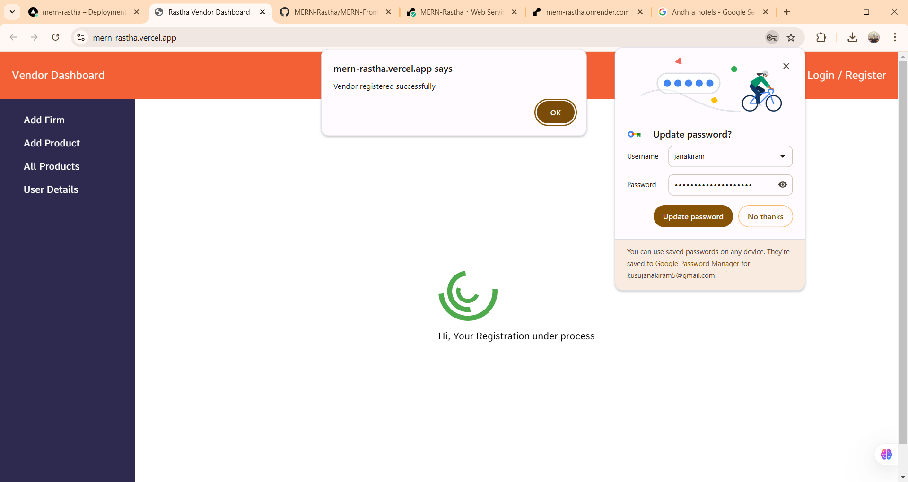
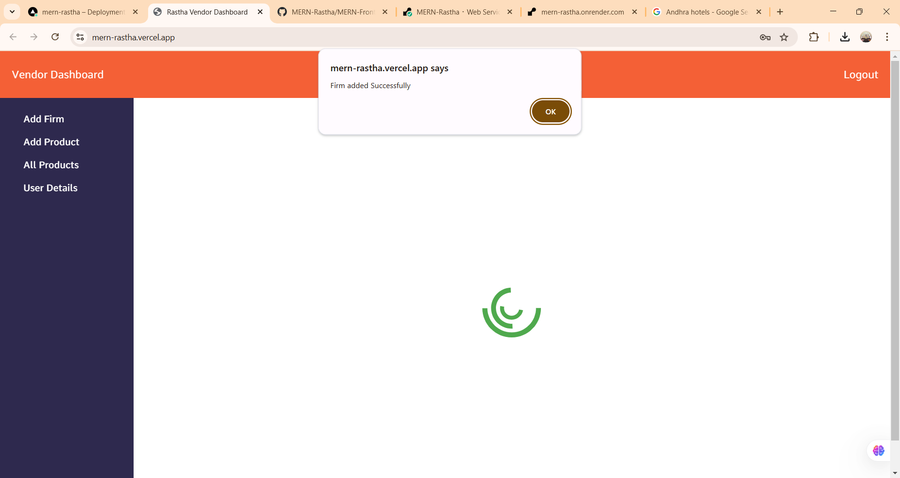
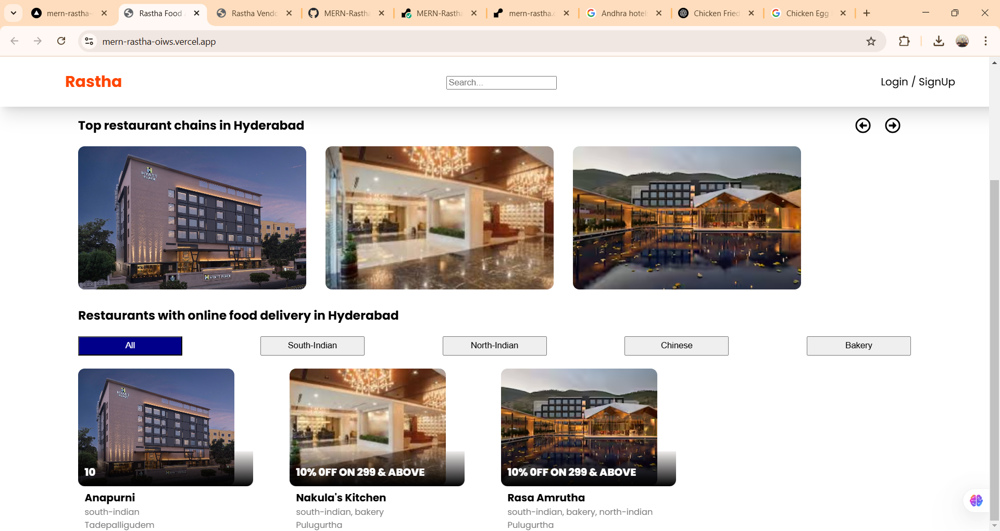

# Rastha - Restaurant Management System

Rastha is a restaurant management system built using the **MERN stack** (MongoDB, Express, React, Node.js). It provides a platform for restaurant owners to manage their restaurant details and products, while users can view available restaurants and their products.

---

## Features

### 1. **Register**
Restaurant owners can create an account to manage their restaurant.

  


---

### 2. **Login**
Owners can log into their account to access the restaurant dashboard.


---

### 3. **Add Restaurant Details**
Restaurant owners can provide restaurant information, such as name, address, and other details.

  
  


---

### 4. **Add Products**
Restaurant owners can add products (e.g., menu items) for their restaurant.

  


---

### 5. **All Products**
Owners can view and delete products from their menu.


---

### **User Side:**

### 6. **Display Restaurants**
Users can view a list of available restaurants.

 


---

### 7. **Display Products**
Users can explore the products (menu items) of each restaurant.


---

## Technologies Used

- **Backend**: Node.js, Express
- **Frontend**: React
- **Database**: MongoDB
- **Deployment**:
  - **Backend**: Render
  - **Frontend**: Vercel

---

## Installation

### Clone the repository:

```bash
git clone https://github.com/janakiramkusu/MERN-Rastha.git
